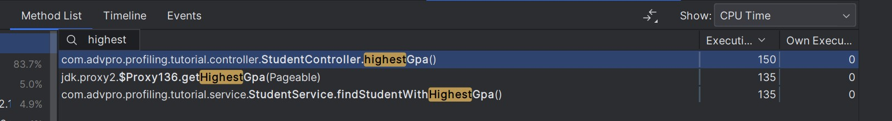

## Module 5 - Java Profiling

After the profiling and performance optimization process is completed, perform a performance test again using JMeter, 
see the results, and compare with the first measurement. Is there an improvement from JMeter measurements?
> Ya, terdapat peningkatan performa dimana terjadi penurunan waktu sample time yang sangat signifikan pada setiap request.
Dari hal tersebut, dapat disimpulkan bahwa proses performance optimization berhasil memperbaiki performa aplikasi yang belum optimal.

* JMeter Tests
  - all-student Request (Before)
  
  - all-student Request (After)
  
  - all-student-name Request (Before)
  
  - all-student-name Request (After)
  
  - highest-gpa Request (Before)
  
  - highest-gpa Request (After)
  

* JMeter Command Line Test
  - Test Plan 1
  
  - Test Plan 2
  
  - Test Plan 3
  
  

* Profiling with InteliJ
  - getAllStudentWithCourse() (Before)
  
  - getAllStudentWithCourse() (After)
  
  - allStudentName() (Before)
  
  - allStudentName() (After)
  
  - HighestGpa() (Before)
  
  - HighestGpa() (After)
  

### Refleksi Module 5
1. What is the difference between the approach of performance testing with JMeter and profiling with IntelliJ Profiler in the context of optimizing application performance? 
> Performance testing menggunakan JMeter bertujuan untuk mengukur kinerja keseluruhan aplikasi di bawah kondisi beban yang berbeda, seperti mengidentifikasi bagaimana aplikasi berperilaku saat diberi jumlah pengguna atau permintaan yang spesifik.
Sedangkan Profiling with InteliJ lebih kepada menganalisis perilaku internal aplikasi, termasuk penggunaan CPU, konsumsi memori, dan aktivitas thread. Karena berfokus menganalisis internal aplikasi, profiling dapat mengoptimalkan area spesifik kode untuk kinerja yang lebih baik.

2. How does the profiling process help you in identifying and understanding the weak points in your application? 
> Adanya profiling membuat saya bisa melihat method-method atau area-area dari kode yang memiliki memakan sumber daya sistem tinggi. Selain itu, profiling juga memberikan gambaran dimana saja mengidentifikasi area-area mana saja aplikasi menghabiskan sebagian besar waktunya. 
Dengan adanya gambaran-gambaran tersebut, saya dapat dengan mudah untuk melakukan optimisasi dengan hanya berfokus pada method-method yang perlu ditingkatkan performanya.

3. Do you think IntelliJ Profiler is effective in assisting you to analyze and identify bottlenecks in your application code? 
> Ya, saya cukup merasa terbantu oleh Profiler di InteliJ dalam menganalisis dan mengidentifikasi bottleneck di kode aplikasi saya. Adanya flame graph yang tervisualisasi dengan baik membantu saya melihat method-method mana saja yang mengkonsumsi resources paling banyak.

4. What are the main challenges you face when conducting performance testing and profiling, and how do you overcome these challenges? 
> Tutorial modul 5 ini adalah kali pertama saya melakukan performance testing dan profiling. Pada awalnya, saya bingung harus melakukan apa dan bagaimana cara membaca hasil yang muncul. Saya juga merasa, bagian yang cukup sulit dalam melakukan performance test dan profiling adalah pada saat awal melakukan setup seeding yang sangat lama dan pada saat melakukan optimisasi dengan mengubah method-method yang harus di-optimize.
Namun, dengan membaca tutorial dengan seksama dan berdiskusi dengan teman membantu saya untuk menyelesaikan performance test dan profiling ini.

5. What are the main benefits you gain from using IntelliJ Profiler for profiling your application code?
> Keuntungan dari menggunakan IntelliJ Profiler pada saat melakukan profiling adalah saya bisa langsung fokus ke akar masalah performa aplikasi karena Intellij Profiler menunjukkan bagian-bagian mana saja dari aplikasi yang memakan resource paling banyak. Jadi kita bisa langsung fokus ke method-method yang diprioritaskan untuk di optimalkan saja.

6. How do you handle situations where the results from profiling with IntelliJ Profiler are not entirely consistent with findings from performance testing using JMeter? 
> Untuk menghandle situasi tersebut, saat melakukan profiling saya akan melakukan pengecekan hasil secara berulang (minimal 3 kali) lalu saya perkirakan rata-ratanya. Hal serupa saya akan lakukan juga pada saat melakukan performance testing dengan JMeter. Intinya untuk prosesnya, saya akan melakukan perbaikan performa-->profiling-->performance test dan setelah melakukan beberapa kali langskah tersebut, saya rasa hasilnya sudah cukup konsisten.

7. What strategies do you implement in optimizing application code after analyzing results from performance testing and profiling? How do you ensure the changes you make do not affect the application's functionality?
> Saya mencoba untuk menerepakan beberapa teknik yang efisien pada beberapa method yang ada. Misalnya, Saya lebih menggunakan StringBuilder daripada konkatenasi string secara berulang pada metode joiStudentNames. Karena saya pikir jika melakukan konkatenasi string secara berulang akan menghabiskan lebih banyak memori. 
Selain itu, saya juga mencoba mempelajari penggunaan anotasi @Query untuk mengambil data HighestGPA. Setelah melakukan perbaikan performa, saya melakukan uji test kembali guna memastikan hasil output yang keluar tetap sama dengan sebelum dilakukan perubahan.